<p align="center">
  
</p>

# slicer-forge

<p align="center">
  <a href="README.md"></a>
    <a href="README.es.md"></a>
    <a href="README.fr.md"></a>
    <a href="README.de.md"></a>
    <a href="README.pt-BR.md"></a>
</p>
<p align="center">
  <a href="README.zh-CN.md"></a>
    <a href="README.ja.md"></a>
    <a href="README.ko.md"></a>
    <a href="README.it.md"></a>
    <a href="README.ar.md"></a>
</p>

<p align="center">
  
</p>

<p align="center">
  
</p>

<p align="center">
  <a href="https://github.com/DaCameraGirl/slicer-forge/actions/workflows/ci.yml"></a>
  
  
</p>

**[`dicom-forge`](https://github.com/DaCameraGirl/dicom-forge) 파이프라인으로 DICOM 일괄 가져오기 [3D Slicer](https://www.slicer.org/) 확장.**

**DICOM Forge Batch** 모듈: 비식별화, QC, NRRD 변환, 장면 로드.

<p align="center">
  
</p>

## The two-repo design

| Repo | Role | Tested |
|------|------|--------|
| [`dicom-forge`](https://github.com/DaCameraGirl/dicom-forge) | Headless pipeline (ingest · de-id · QC · convert) | Unit-tested in CI without Slicer |
| **`slicer-forge`** (this) | Thin Slicer GUI on top of it | Self-test runs inside Slicer |

This mirrors how Slicer itself is built (ITK/VTK do the work; the GUI is a shell on top). All the heavy logic lives in `dicom-forge`, so it is fully testable on its own; this repo stays a small, focused front-end.

## What the module does

1. **Install dependencies** — one button runs `pip_install('dicom-anvil[convert]')` into Slicer's own Python environment (the engine ships on PyPI as `dicom-anvil`; it still imports as `dicomforge`).
2. **Pick folders** — a DICOM input folder and an output folder.
3. **Choose options** — de-identification level (basic / moderate / strict) and output format (NRRD / NIfTI).
4. **Run** — every series is de-identified → QC'd → converted → loaded into the scene, with a per-series PASS/FAIL summary and warnings. Long runs stay responsive and can be cancelled.

📖 **New to the module?** Follow the step-by-step [usage tutorial](docs/tutorial.md). See the [changelog](CHANGELOG.md) for what has changed.

## Installation

### From source (developer install)

```bash
git clone https://github.com/DaCameraGirl/slicer-forge.git
```

In Slicer: **Edit → Application Settings → Modules → Additional module paths**, add the `slicer-forge/DicomForgeBatch` folder, and restart. The **DICOM Forge Batch** module appears under the *Informatics* category.

### Build as a loadable extension

The repo is laid out for the standard Slicer extension build (`CMakeLists.txt` + `slicerMacroBuildScriptedModule`) so it can be built against a Slicer build tree and submitted to the [Slicer Extensions Index](https://github.com/Slicer/ExtensionsIndex).

## Module anatomy

Slicer scripted modules use a fixed four-class shape — this one lives in [`DicomForgeBatch/DicomForgeBatch.py`](DicomForgeBatch/DicomForgeBatch.py):

- `DicomForgeBatch` — module metadata.
- `DicomForgeBatchWidget` — the GUI panel (built programmatically).
- `DicomForgeBatchLogic` — Qt-free logic wrapping `dicom-forge` (reusable from the Python console).
- `DicomForgeBatchTest` — a self-test that generates synthetic DICOM and runs the whole pipeline inside Slicer.

## Testing

The self-test runs **inside** Slicer (it needs the `slicer` runtime):

> Slicer → **Developer Tools → Self Tests** → run *DicomForgeBatch*, or from the Python console: `slicer.util.selfTest('DicomForgeBatch')`.

CI runs on every push at two levels:

- a **fast lane** lint-checks and byte-compiles the module, and
- a **headless-Slicer lane** that downloads real 3D Slicer and runs the full pipeline end-to-end — de-id → QC → convert → load — across CT and MR, multiple series, both output formats, every de-identification level, and failure paths.

> ⚠️ De-identification is best-effort risk reduction, not a compliance guarantee. See [`dicom-forge`'s SECURITY policy](https://github.com/DaCameraGirl/dicom-forge/blob/main/SECURITY.md).

## License

[Apache-2.0](LICENSE) © Angela Hudson
